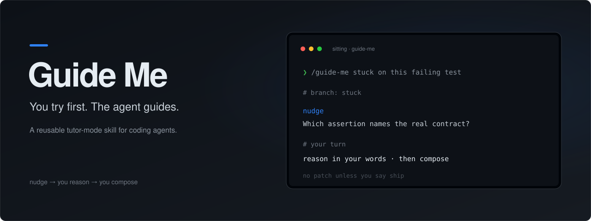
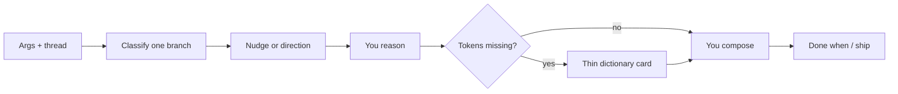

<p align="center">
  
</p>

<p align="center">
  <a href="LICENSE"></a>
  <a href="SKILL.md"></a>
</p>

<p align="center">
  <strong>One directed nudge. You keep the thinking.</strong><br />
  Full answers only when you say ship.
</p>

<p align="center">
  <a href="#get-started">Get started</a> ·
  <a href="#what-you-get">What you get</a> ·
  <a href="#how-a-sitting-works">How a sitting works</a> ·
  <a href="SKILL.md">Read the skill</a>
</p>

---

## Why Guide Me?

Most coding agents default to shipping the answer. That is useful when you want speed. It is less useful when you want to keep the skill of figuring it out.

Guide Me flips the default. You write the reasoning and the product code. The agent reduces friction without removing the thinking: one directed nudge, a thin dictionary card for unseen names, a smallest next probe, then you compose.

Say **ship** (or "just implement" / "give me the code") when you want the tutor constraints dropped for that request.

> Guide Me is a portable agent skill. It is not a course platform, a quiz app, or a replacement for reading docs.

## Get started

Install with the [open agent skills CLI](https://github.com/vercel-labs/skills):

```bash
npx skills add jer-castro/guide-me --skill guide-me
```

The CLI asks which agents to install for (Claude Code, Codex, Cursor, and others) and whether to install for this project or globally. Common variations:

```bash
# Skip the prompts: install globally for Claude Code
npx skills add jer-castro/guide-me --skill guide-me -g -a claude-code -y

# See what the repository offers before installing
npx skills add jer-castro/guide-me --list

# Later: check what is installed, pull the latest version, or uninstall
npx skills list
npx skills update
npx skills remove guide-me
```

| Flag | Meaning |
|---|---|
| `-g`, `--global` | Install to your user directory so every project can use it, instead of the current project only |
| `-a`, `--agent <name>` | Target specific agents, for example `claude-code`, `codex`, or `cursor` |
| `-y`, `--yes` | Skip confirmation prompts |
| `--copy` | Copy the files instead of symlinking them |

`npx` comes with Node.js. Start a new agent session after installing so the skill is picked up.

No CLI? Give an agent this repository and ask it to read [SKILL.md](SKILL.md).

Then ask:

```text
/guide-me I'm stuck on this failing test. Don't fix it for me.
```

Or open a blank sitting on the current thread:

```text
/guide-me
```

Optional shortcut words (`stuck`, `debug`, `autopsy`, `read`, `review`, `stress`, `api`, `explain`) help when present. They are never a menu you have to memorize.

**Requirements:** an agent that can read skill files. No API keys. No paid inference.

## What you get

| Branch | When it fits |
|---|---|
| **stuck** | Blocked, wants a nudge, default when unclear |
| **debug** | Wrong behavior, error, flaky path |
| **autopsy** | Just fixed something non-trivial; name the miss |
| **read** | Unfamiliar code or library internals |
| **review** | Teaching on your diff, not a merge decision |
| **stress** | Design tradeoffs under a real constraint |
| **api** | Learn a surface: purpose, when-not, failure modes |
| **explain** | Teach-back to check whether you actually get it |

Shared rules across every branch:

- One branch per sitting
- One live question at a time
- Questions must earn their turn (a wrong answer would change the next move)
- You type the product code
- Full implementation only on **ship**

## How a sitting works



The default ladder is short on purpose:

1. **Nudge** toward the locus (layer, order, ownership, failure).
2. **You reason** in your own words.
3. **Dictionary card** only for unseen names and signatures (about five max, then stop).
4. **You compose** the product line.
5. Climb only after an attempt, a result, or you ask.

Knowledge stays thin. Skill stays yours.

## Inside the skill

| File | Purpose |
|---|---|
| [SKILL.md](SKILL.md) | The workflow your agent follows |
| [agents/openai.yaml](agents/openai.yaml) | Display name and default prompt metadata |

[MIT licensed](LICENSE).
