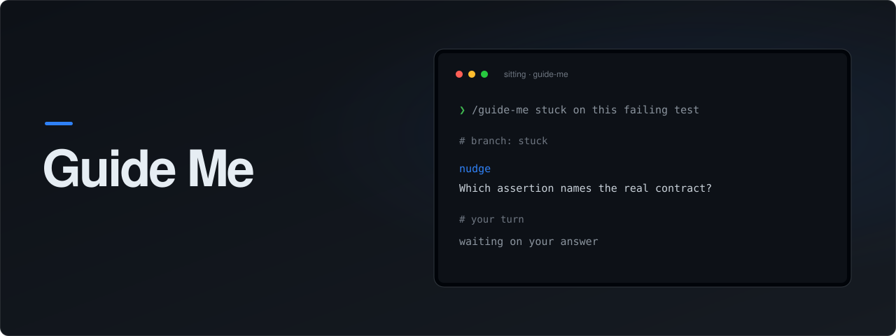
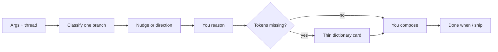

<p align="center">
  
</p>

Guide Me is a portable agent skill that nudges instead of shipping code by default.

Install with the [open agent skills CLI](https://github.com/vercel-labs/skills):

```bash
npx skills add jer-castro/guide-me --skill guide-me
```

The CLI asks which agents to install for (Claude Code, Codex, Cursor, and others) and whether to install for this project or globally. Common variations:

```bash
# Skip the prompts: install globally for Claude Code
npx skills add jer-castro/guide-me --skill guide-me -g -a claude-code -y

# See what the repository offers before installing
npx skills add jer-castro/guide-me --list

# Later: check what is installed, pull the latest version, or uninstall
npx skills list
npx skills update
npx skills remove guide-me
```

| Flag | Meaning |
|---|---|
| `-g`, `--global` | Install to your user directory so every project can use it, instead of the current project only |
| `-a`, `--agent <name>` | Target specific agents, for example `claude-code`, `codex`, or `cursor` |
| `-y`, `--yes` | Skip confirmation prompts |
| `--copy` | Copy the files instead of symlinking them |

`npx` comes with Node.js. Start a new agent session after installing so the skill is picked up.

No CLI? Give an agent this repository and ask it to read [SKILL.md](SKILL.md).

## Why Guide Me?

Coding agents default to shipping answers. This skill flips that: you write the reasoning and the product code. Say **ship** (or "just implement" / "give me the code") to drop the tutor constraints for that request.

## Use

```text
/guide-me I'm stuck on this failing test. Don't fix it for me.
```

Or open a blank sitting on the current thread:

```text
/guide-me
```

Optional shortcut words (`stuck`, `debug`, `autopsy`, `read`, `review`, `stress`, `api`, `explain`) help when present. They are never a menu you have to memorize.

**Requirements:** an agent that can read skill files. No API keys. No paid inference.

## Branches

| Branch | When it fits |
|---|---|
| **stuck** | Blocked, wants a nudge, default when unclear |
| **debug** | Wrong behavior, error, flaky path |
| **autopsy** | Just fixed something non-trivial; name the miss |
| **read** | Unfamiliar code or library internals |
| **review** | Teaching on your diff, not a merge decision |
| **stress** | Design tradeoffs under a real constraint |
| **api** | Learn a surface: purpose, when-not, failure modes |
| **explain** | Teach-back to check whether you actually get it |

Shared rules across every branch:

- One branch per sitting
- One live question at a time
- Questions must earn their turn (a wrong answer would change the next move)
- You type the product code
- Full implementation only on **ship**

## How a sitting works


```mermaid
flowchart LR
    A[Args + thread] --> B[Classify one branch]
    B --> C[Nudge or direction]
    C --> D[You reason]
    D --> E{Tokens missing?}
    E -->|yes| F[Thin dictionary card]
    E -->|no| G[You compose]
    F --> G
    G --> H[Done when / ship]
```

The default ladder:

1. **Nudge** toward the locus (layer, order, ownership, failure).
2. You state the reasoning.
3. **Dictionary card** only for unseen names and signatures (about five max, then stop).
4. You write the product line.
5. Climb only after an attempt, a result, or you ask.

## Files

| File | Purpose |
|---|---|
| [SKILL.md](SKILL.md) | The workflow your agent follows |
| [agents/openai.yaml](agents/openai.yaml) | Display name and default prompt metadata |

[MIT licensed](LICENSE).
